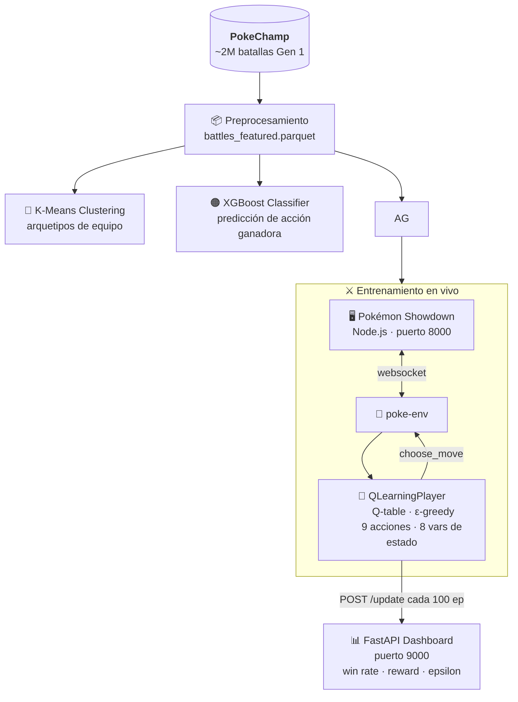

<div align="center">


# Pokémon Showdown RL

**Agente de Q-Learning que aprende a jugar Pokémon — en tiempo real**

[](https://python.org)
[](https://fastapi.tiangolo.com)
[](https://scikit-learn.org)
[](https://xgboost.readthedocs.io)
[](https://huggingface.co/datasets/milkkarten/pokechamp)
[](https://nodejs.org)

</div>

---

## ¿Qué es esto?

Proyecto de **Sistemas Inteligentes** que entrena un agente de Reinforcement Learning para ganar combates Pokémon con equipo completo de 6. El agente aprende desde cero usando Q-Learning tabular, peleando contra un oponente aleatorio en **Pokémon Showdown** (servidor local), mientras un dashboard muestra el progreso en tiempo real.

El proyecto combina tres técnicas de ML sobre ~2 millones de batallas reales:

| # | Técnica | Qué hace |
|---|---------|----------|
| 1 | **Clustering** (K-Means) | Descubre arquetipos de equipo en Gen 1 |
| 2 | **Clasificación** (XGBoost) | Predice la acción ganadora dado el estado del combate |
| 3 | **Refuerzo** (Q-Learning) | Agente que juega con equipo de 6 Pokémon |

---

## Demo

> El combate se ve en vivo en el browser mientras el agente entrena.

```
┌─────────────────────────────────────────────────┐
│  🎮 Pokémon RL — Dashboard de Entrenamiento     │
├──────────┬──────────┬──────────┬────────────────┤
│ Episodio │ Win Rate │  Reward  │    Epsilon     │
│   2000   │  73.0%   │   4.2    │    0.05        │
├──────────┴──────────┴──────────┴────────────────┤
│  ████████████████░░░░  Win Rate por episodio    │
├─────────────────────────────────────────────────┤
│  Últimas 10 batallas                            │
│  Ep.1950: WIN  +8.3  |  Ep.1960: LOSS  -2.1    │
└─────────────────────────────────────────────────┘
```

- `http://localhost:8000` → combates en vivo (Pokémon Showdown)
- `http://localhost:9000` → dashboard de entrenamiento

---

## Arquitectura



---

## Instalación y uso

### Requisitos

- Python 3.11+
- Node.js
- [`uv`](https://docs.astral.sh/uv/)

### Setup inicial (una sola vez)

```bash
git clone https://github.com/tu-usuario/pokemon-agent.git
cd pokemon-agent
uv run python src/00_setup.py
uv run python src/01_download.py
uv run python src/02_preprocess.py
```

### Pipeline ML

```bash
uv run python src/03_clustering.py
uv run python src/04_classification.py
```

### Entrenamiento del agente (3 terminales)

```bash
# Terminal A — servidor Showdown
cd showdown && node pokemon-showdown start --no-security

# Terminal B — dashboard
uv run python src/06_dashboard.py

# Terminal C — agente (arrancar después de A y B)
uv run python src/05_train_agent.py
```

### Figuras e informe

```bash
uv run python src/07_report_figures.py
```

---

## Stack tecnológico

| Categoría | Tecnología |
|-----------|-----------|
| Entorno de combate | [`poke-env`](https://github.com/hsahovic/poke-env) + Pokémon Showdown |
| Dataset | [PokeChamp (HuggingFace)](https://huggingface.co/datasets/milkkarten/pokechamp) — ~2M batallas |
| ML | scikit-learn, XGBoost, NumPy, pandas |
| Dashboard | FastAPI + Chart.js |
| Gestión de deps | `uv` |
| Visualización | matplotlib, seaborn |

---

## Estructura del proyecto

```
pokemon-agent/
├── src/
│   ├── 00_setup.py          # instalación y configuración
│   ├── 01_download.py       # descarga de datasets
│   ├── 02_preprocess.py     # feature engineering
│   ├── 03_clustering.py     # K-Means arquetipos
│   ├── 04_classification.py # XGBoost predicción
│   ├── 05_train_agent.py    # Q-Learning agente
│   ├── 06_dashboard.py      # FastAPI dashboard
│   └── 07_report_figures.py # figuras para informe
├── data/
│   ├── raw/                 # datos originales
│   └── processed/           # parquet procesado
├── outputs/
│   ├── figures/             # gráficas
│   ├── models/              # modelos entrenados (.pkl)
│   └── metrics.json         # métricas unificadas
└── report/
    └── ieee_report.md       # informe final
```

---

## El agente Q-Learning

**Estado** (8 variables discretas, Q-table tabular):
- HP propio y rival en 4 rangos (0–25%, 25–50%, 50–75%, 75–100%)
- Ventaja de tipo (-1 / 0 / +1)
- ¿El activo propio es más rápido?
- Pokémon propios y rivales en pie (1–6)
- Movimientos disponibles y si hay switch posible

**Acciones** (9 fijas): slots 0–3 = movimientos, slots 4–8 = switches

**Reward**: +1.5 daño infligido · −1.0 daño recibido sin infligir · ±0.5 calidad del switch · ±10 victoria/derrota

**Hiperparámetros**: lr=0.1, γ=0.9, ε 1.0→0.05 en 1500 episodios, 2000 episodios totales

---

<div align="center">


*Proyecto académico — Sistemas Inteligentes*

</div>
