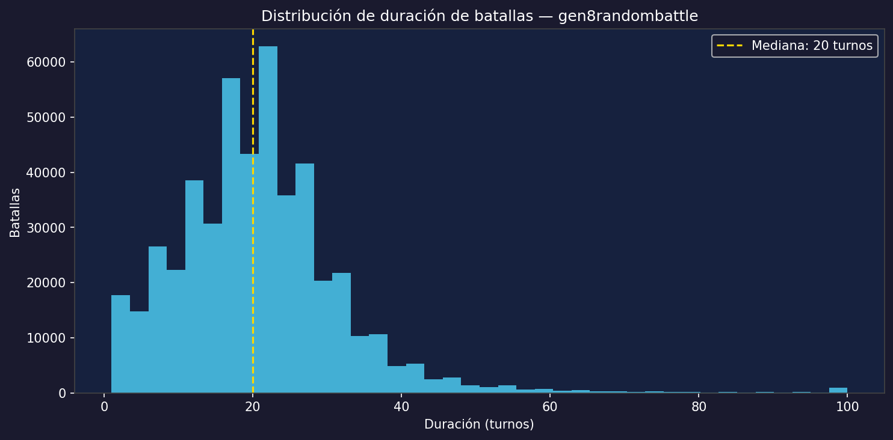
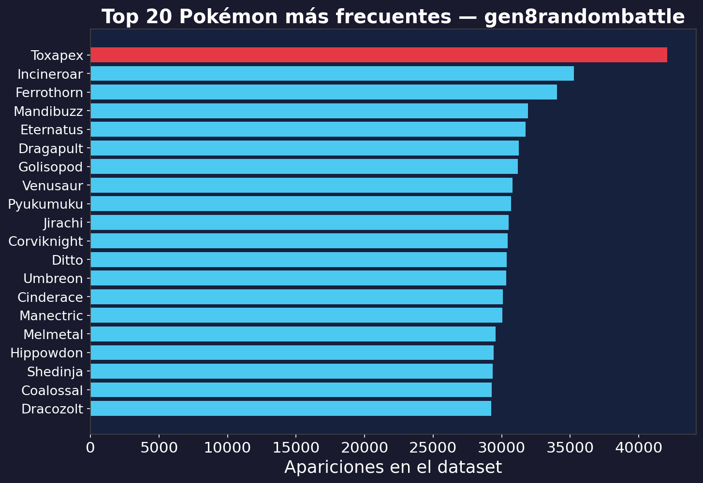
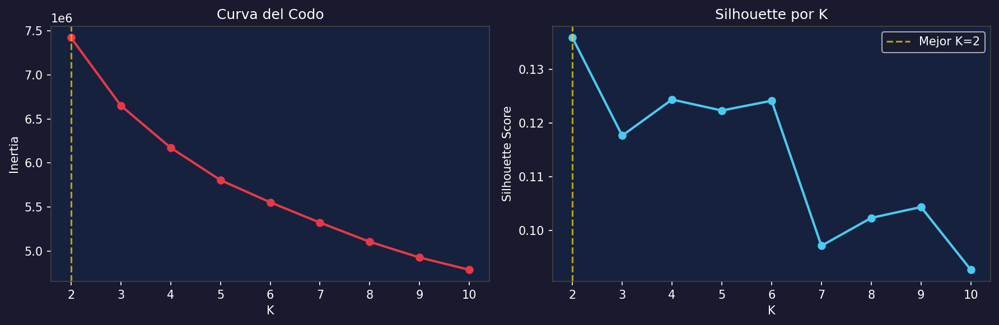
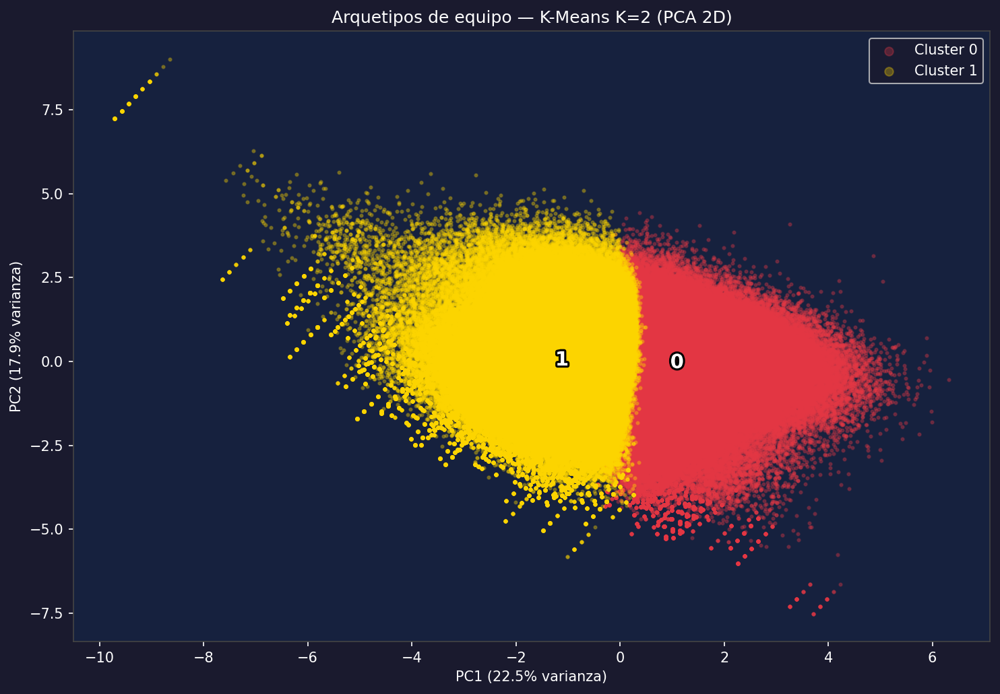
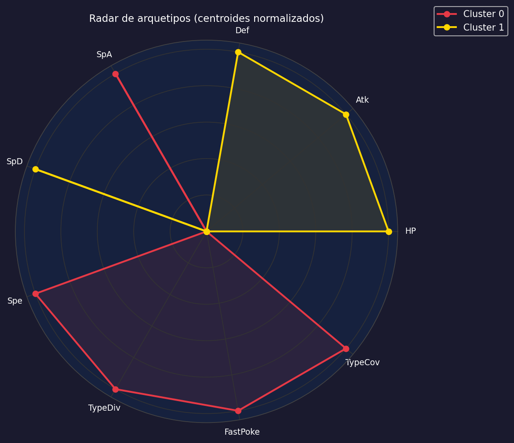
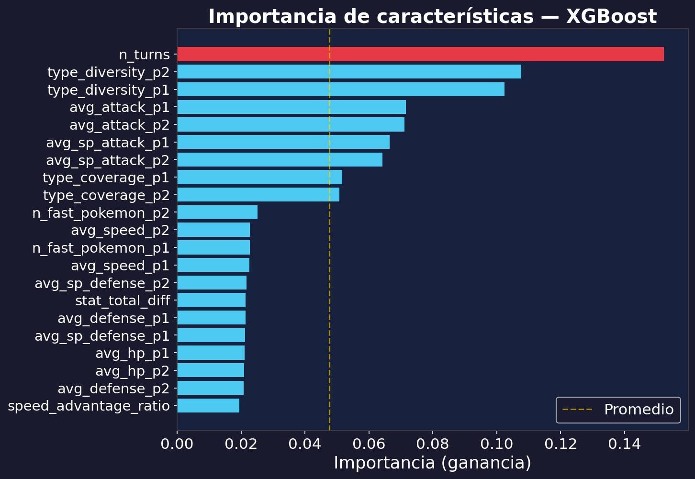
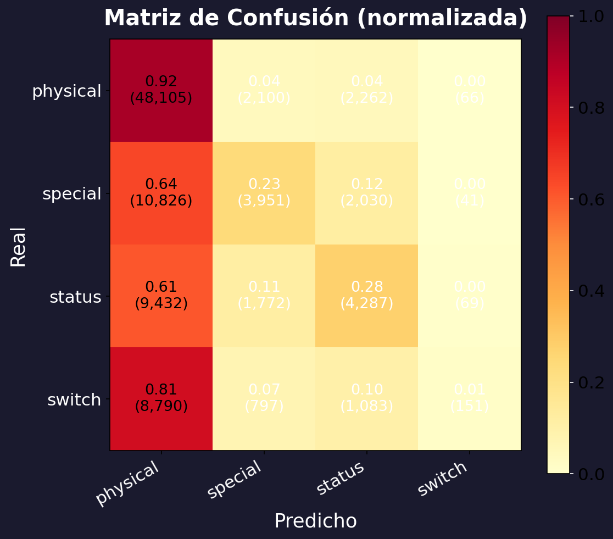
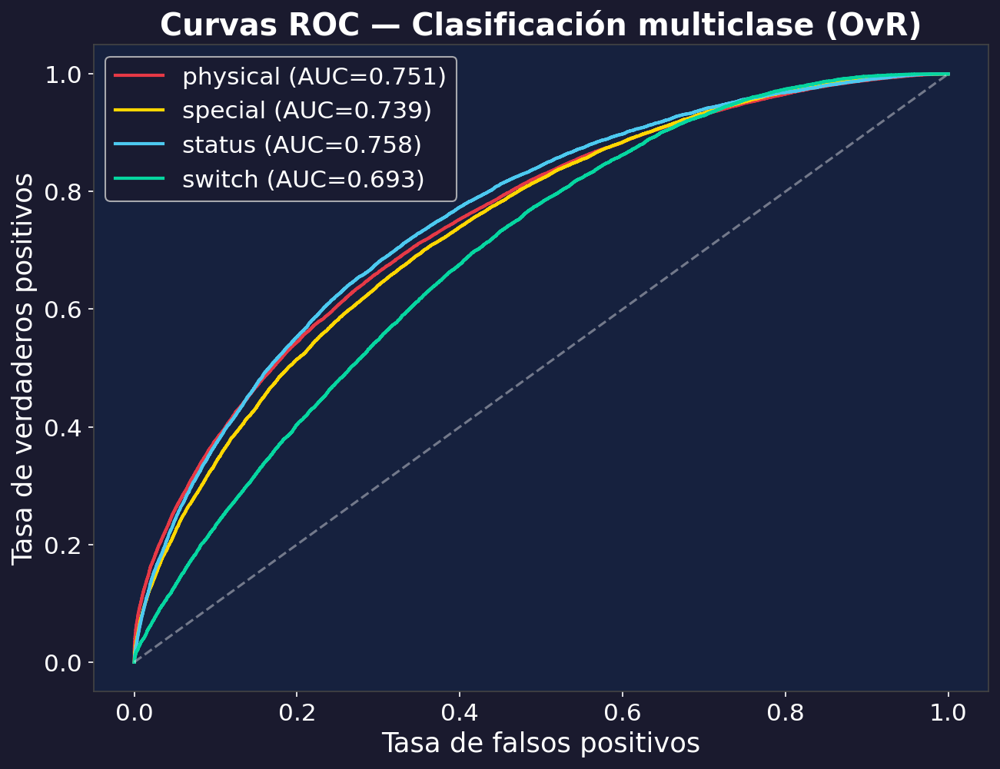
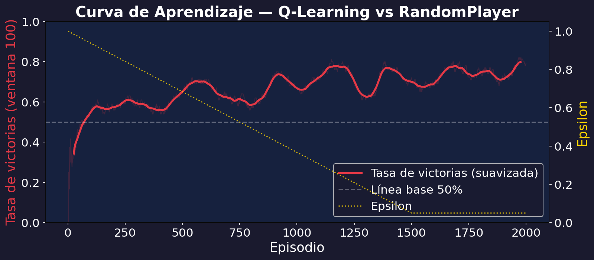

# Aprendizaje Maquinal en Pokémon Showdown: Agrupación, Clasificación y Aprendizaje por Refuerzo

**Gabriel Andrés Anzola Tachak · Nicolas David Moreno Villanueva**
Universidad Nacional de Colombia · `ganzola@unal.edu.co` · `nimorenov@unal.edu.co`

---

## Abstract

Cada partida de Pokémon Showdown deja un replay público: una decisión humana bajo incertidumbre, registrada turno a turno. Sobre 484,130 batallas reales del formato Gen 8 Random Battle aplicamos una técnica de cada familia del aprendizaje maquinal. K-Means encuentra apenas dos arquetipos de equipo —ofensivo y defensivo— débilmente separados (silhouette=0.136), lo esperable cuando todos los equipos salen del mismo sorteo. XGBoost resulta interesante por lo que *no* encuentra: el perfil estadístico de un equipo casi no delata el estilo con el que gana (59% de exactitud frente a un 54% de base), señal de que el estilo se decide jugando y no armando el equipo. Por último, un agente de Q-Learning tabular aprende desde cero a ganar el 76.6% de sus partidas contra un rival aleatorio, con un espacio de estados anclado en lo que de verdad decide un turno: velocidad, ventaja de tipo y HP. Las tres técnicas atacan el mismo corpus desde ángulos distintos —describir, explicar y actuar— y comparten esos ejes tácticos del dominio.

**Palabras clave:** aprendizaje por refuerzo, gradient boosting, K-Means, Pokémon Showdown, agente autónomo

---

## I. Introducción

Pokémon es una franquicia de videojuegos de rol creada por Game Freak en 1996, con más de 480 millones de copias vendidas a marzo de 2024 [1]. Su mecánica central son los combates por turnos entre criaturas llamadas Pokémon, cada una con estadísticas base — puntos de vida (HP, del inglés *Hit Points*), Ataque, Defensa, Velocidad —, tipos elementales y hasta cuatro movimientos. El combate es un duelo de información incompleta: cada turno ambos jugadores eligen una acción simultáneamente, a ciegas respecto a la del rival.

Dos factores dominan la táctica: la **ventaja de tipo** y la **velocidad**. Un movimiento de tipo Agua hace el doble de daño a un Pokémon de tipo Fuego, pero la mitad a uno de Planta — hay dieciocho tipos con relaciones asimétricas entre ellos. La velocidad determina quién actúa primero: el Pokémon más veloz puede noquear al rival antes de recibir contraataque, lo que convierte la composición del equipo en una decisión estratégica de alto impacto.

**Pokémon Showdown** [2] es un simulador de combate de código abierto con más de 100,000 usuarios activos que replica fielmente estas mecánicas en el navegador. Cada partida queda guardada como un replay público, creando un corpus poco común: decisiones humanas bajo incertidumbre, completamente observables y reproducibles.

El formato **Gen 8 Random Battle** (generación 8, Pokémon Sword/Shield, 2019) reparte equipos aleatorios de seis Pokémon al inicio de cada batalla. Al eliminar la fase de construcción de equipo, concentra todo el desafío en las decisiones durante el combate. La generación 8 añade además **Dynamax**: un Pokémon puede duplicar temporalmente sus HP durante tres turnos, una palanca estratégica más sobre la mesa.

Este trabajo extrae conocimiento de 484,130 batallas reales [3] con tres técnicas complementarias: (1) K-Means descubre si existen arquetipos naturales de equipo; (2) XGBoost mide cuánto delata el perfil de un equipo el estilo con que gana; (3) un agente de aprendizaje por refuerzo aprende a jugar a partir de los mismos factores tácticos que las dos primeras ponen sobre la mesa. El código fuente está disponible en https://github.com/gabotachak/pokemon-agent.

La contribución no está en superar un récord de rendimiento, sino en recorrer las tres familias del aprendizaje maquinal sobre un mismo corpus dejando que cada una responda la pregunta que sabe responder: K-Means describe, XGBoost explica y el agente actúa. Las tres se sostienen sobre los mismos ejes del dominio —velocidad, ventaja de tipo y HP—, lo que da unidad al recorrido.

---

## II. Trabajo Relacionado

El aprendizaje por refuerzo (RL, del inglés *Reinforcement Learning*) se aplica a videojuegos desde los años 90, desde programas de Backgammon [4] hasta sistemas de nivel profesional. En el dominio de Pokémon, Sahovic [5] desarrolló poke-env, la librería Python estándar para conectar agentes al simulador Pokémon Showdown, y mostró que agentes basados en redes neuronales profundas (DQN, *Deep Q-Network*) superan el 80% de victorias contra oponentes aleatorios en Gen 1. Jin et al. [6] compilaron PokeChamp, un dataset de millones de batallas con modelos de aprendizaje por imitación — aprender a replicar las acciones de jugadores expertos.

En mayor escala, AlphaStar [7] y OpenAI Five [8] demostraron que RL con redes profundas puede alcanzar nivel profesional en juegos complejos como StarCraft II y Dota 2, aunque con un presupuesto de cómputo fuera del alcance de la mayoría de contextos de investigación.

Frente a estos trabajos, el nuestro combina agrupación no supervisada, clasificación supervisada y RL tabular interpretable en un flujo coherente sobre datos Gen 8, priorizando la extracción de conocimiento comprensible por encima del rendimiento máximo.

---

## III. Dataset y Preprocesamiento

### A. Dataset

El corpus HolidayOugi/pokemon-showdown-replays [3] contiene 31.7 millones de replays de Pokémon Showdown. Se seleccionó el formato gen8randombattle (**484,130 batallas**), descargando únicamente los 3 archivos parquet correspondientes para no bajar los 66 GB completos. Cada registro incluye metadatos de la partida y el campo `log` con el transcript completo del combate.

*Fig. 1: Duración de batallas en turnos (la mayoría entre 10 y 30 turnos, con mediana de 20).*

*Fig. 2: Pokémon más frecuentes en el corpus — reflejan el pool aleatorio del formato.*

### B. Análisis del Log y Extracción de Características

El campo `log` codifica cada evento en líneas del tipo `|COMANDO|argumentos`. De cada batalla se extraen los equipos (identificados cuando cada Pokémon entra al combate), el ganador, la duración en turnos, los movimientos usados y los cambios voluntarios. Los nombres de Pokémon se normalizan y se cruzan con estadísticas base (PokeAPI [9]) para calcular promedios por equipo.

| Característica | Interpretación táctica |
|---------|------------------------|
| `avg_speed` | Velocidad promedio — el Pokémon más veloz actúa primero cada turno |
| `speed_advantage_ratio` | Velocidad p1 / p2 — quién controla el ritmo del combate |
| `stat_total_diff` | Diferencia de stats totales — proxy de ventaja estadística global |
| `type_coverage` | Tipos de movimientos disponibles — amplitud ofensiva del equipo |
| `switch_rate` | Cambios por turno del ganador — *excluida del clasificador por fuga de información* (ver IV-B) |
| `n_fast_pokemon` | Pokémon con velocidad >100 — capaces de actuar antes que la mayoría |

*Tabla 1: Características derivadas con su interpretación en contexto de combate (selección).*

La **variable objetivo** para clasificación es `winning_action_type`: el tipo de acción más frecuente del jugador ganador. Responde a la pregunta *¿cómo gana el que gana?* Cuatro categorías: movimiento físico, especial, de estado o cambio de Pokémon.

---

## IV. Metodología

### A. Agrupación — K-Means

**¿Existen estilos de equipo naturales en batallas aleatorias, o todos los equipos son estadísticamente indistinguibles?**

K-Means [10] es un algoritmo de agrupamiento no supervisado que asigna cada punto al grupo más cercano y recalcula los centros iterativamente hasta convergencia, minimizando la varianza interna de cada grupo:

$$J = \sum_k \sum_{x \in C_k} \|x - \mu_k\|^2$$

donde $\mu_k$ es el centro del grupo $k$. No requiere etiquetas previas — descubre la estructura que emerge naturalmente de los datos.

Para elegir el número de grupos K usamos el *silhouette score* [11], que mide qué tan bien separado está cada punto de los demás grupos comparando la cohesión interna con la distancia al grupo vecino más cercano:

$$s(i) = \frac{b(i) - a(i)}{\max(a(i), b(i))}, \quad s(i) \in [-1, 1]$$

donde $a(i)$ es la distancia media a los otros puntos del mismo grupo y $b(i)$ la distancia media al grupo vecino más cercano. Valores cercanos a 1 indican grupos bien separados; cercanos a 0, solapamiento.

Flujo: vectores de equipo (9 características) → normalización → análisis de componentes principales (PCA [12], para reducir a 2 dimensiones y poder visualizar) → K-Means con K=2..10.

*Fig. 3: Inercia y silhouette score para K=2..10. El máximo de silhouette ocurre en K=2.*

*Fig. 4: Proyección PCA coloreada por grupo. Grupo 0: mayor velocidad. Grupo 1: mayor HP y defensa.*

*Fig. 5: Radar de centroides normalizados de cada arquetipo de equipo.*

**Resultado:** K=2 con silhouette=0.136. La separación es tenue, y tiene sentido que lo sea: todos los equipos vienen del mismo sorteo aleatorio. Aun así, los centroides dibujan dos perfiles reconocibles — equipos veloces y ofensivos frente a equipos resistentes y defensivos.

---

### B. Clasificación — XGBoost

**¿Delata el perfil estadístico de un equipo la estrategia con la que ganará?**

XGBoost [13] implementa *gradient boosting*: construye un conjunto (*ensemble*) de árboles de decisión de forma aditiva, donde cada árbol nuevo corrige los errores del anterior. El modelo final es la suma de T árboles:

$$\hat{y} = \sum_{t=1}^{T} f_t(x)$$

En cada iteración se elige el árbol $f_t$ que minimiza la pérdida acumulada más un término $\Omega(f_t)$ que penaliza árboles innecesariamente complejos para evitar sobreajuste:

$$\mathcal{L}^{(t)} = \sum_i \ell\!\left(y_i,\; \hat{y}_i^{(t-1)} + f_t(x_i)\right) + \Omega(f_t)$$

Además de predecir, XGBoost cuantifica la **importancia** de cada característica: cuánto aportó cada variable al conjunto.

**Configuración:** 21 características, split 80/20 estratificado, hasta 1000 árboles con parada temprana a los 20 sin mejora, GPU. Mejor iteración: 779 árboles.

Antes de leer las métricas, una decisión de diseño. Se excluye `switch_rate` (cambios del ganador por turno) porque se deriva del conteo de cambios del ganador, y ese mismo conteo define la clase `switch` del objetivo: la relación es circular. Con ella presente, `switch` alcanza un AUC de 0.955; sin ella cae a 0.693 y su recall se desploma a 0.01. Todo su poder venía de la circularidad, no de la batalla. Las métricas siguientes corresponden al modelo sin `switch_rate`.

| Clase | Precisión | Recall | F1 | AUC-ROC |
|-------|-----------|--------|----|---------|
| `physical` | 0.624 | 0.916 | 0.742 | 0.751 |
| `special` | 0.458 | 0.235 | 0.310 | 0.739 |
| `status` | 0.444 | 0.276 | 0.340 | 0.758 |
| `switch` | 0.462 | 0.014 | 0.027 | 0.693 |
| **promedio** | | | **0.520** | **0.735** |

*Tabla 2: Métricas por clase sin `switch_rate`. Exactitud global: 59.0% (línea base: 54% prediciendo siempre la clase mayoritaria). El F1 promedio es ponderado; el AUC-ROC promedio es simple. AUC-ROC mide la capacidad discriminativa: 1.0 es perfecto, 0.5 equivale a clasificación aleatoria.*

*Fig. 6: Importancia de características por contribución al conjunto.*

*Fig. 7: Matriz de confusión normalizada.*

*Fig. 8: Curvas ROC por clase (modelo sin `switch_rate`). `switch` es ahora la clase más difícil (AUC 0.693): el comportamiento de cambio no se lee desde el perfil estadístico de los equipos.*

Las variables que más pesan son `n_turns` (la duración de la batalla) y la diversidad de tipos de ambos equipos; el resto aporta poco y `speed_advantage_ratio` queda de último. Conviene leer esto con cuidado: `n_turns` solo se conoce cuando la batalla termina, así que el modelo no anticipa el estilo ganador desde la mesa de armado, sino que lo *explica* en retrospectiva a partir de cómo se desarrolló el combate. Despojado de esas pistas dinámicas, el perfil estático del equipo apenas se distingue del azar. De ahí el hallazgo de fondo: ninguna variable de composición domina la lectura del estilo ganador. El F1 bajo en `special` y `status` refleja el desbalance —`physical` concentra el 54% de los registros— y `switch` se vuelve la clase más esquiva (recall 0.01) una vez retirada `switch_rate`.

---

### C. Aprendizaje por Refuerzo — Q-Learning

**¿Puede un agente aprender a jugar Pokémon Showdown por prueba y error, sin que se le diga explícitamente qué hacer?**

El aprendizaje por refuerzo [14] entrena un agente que interactúa con un entorno: toma acciones, recibe recompensas y ajusta su comportamiento para maximizar la recompensa acumulada a largo plazo. No necesita ejemplos etiquetados ni reglas predefinidas — descubre qué funciona por experiencia directa.

Q-Learning [15] es uno de los algoritmos más simples de RL. Aprende una tabla $Q(s, a)$ que estima la recompensa futura esperada de tomar la acción $a$ en el estado $s$. Tras cada turno, el agente actualiza su estimación:

$$Q(s,a) \leftarrow Q(s,a) + \alpha \left[r + \gamma \max_{a'} Q(s', a') - Q(s,a)\right]$$

El término $r + \gamma \max_{a'} Q(s', a')$ combina la recompensa inmediata $r$ con el mejor valor futuro conocido desde el nuevo estado $s'$, descontado por $\gamma=0.9$. La diferencia con $Q(s,a)$ es el error de predicción que el agente corrige con tasa $\alpha=0.1$.

**Diseño del espacio de estados:** las variables se anclan en los factores tácticos del dominio —velocidad y ventaja de tipo— y en la estructura del combate:

| Variable | Valores | Fundamento |
|----------|---------|------------|
| `hp_self/opp` | 4 cuartiles | Discretización fija de HP en cuartiles |
| `type_advantage` | {−1, 0, +1} | Chart de efectividad de tipos (mecánica del juego, vía poke-env) |
| `can_outspeed` | booleano | Factor velocidad, dominante en la táctica (ver Introducción) |
| `team_size_self/opp` | 1-6 | Pokémon vivos — estado de combate |
| `n_available_moves` | 1-4 | Estructura del espacio de acción |
| `has_switch` | booleano | Disponibilidad de cambio — espacio de acción |

*Tabla 3: Variables de estado del agente y su fundamento. Su producto cartesiano define 27,648 estados teóricos. Velocidad y ventaja de tipo son los mismos ejes que la Introducción señala como dominantes; aunque `speed_advantage_ratio` tenga poco poder predictivo en XGBoost, `can_outspeed` se incluye por su peso táctico real dentro de un turno.*

El agente juega contra un **RandomPlayer**, un oponente que elige acciones uniformemente al azar. Es una línea base deliberadamente sencilla: sirve para confirmar que el agente aprende algo, no para medirse contra un rival fuerte.

**Espacio de acciones:** 9 fijas — los slots 0-3 son movimientos y los 4-8 cambios de Pokémon. Las acciones inválidas caen al primer movimiento disponible.

**Señal de recompensa:** +1.5 por daño infligido, −1.0 por daño recibido sin contraatacar, ±0.5 por la calidad del cambio, ±10 por victoria o derrota al cerrar la batalla.

**Exploración ε-greedy:** el agente arranca eligiendo al azar (ε=1.0) y decae hasta ε=0.05 a lo largo de 1,500 de los 2,000 episodios totales.

*Fig. 9: Tasa de victorias promedio (ventana de 100 episodios) y decaimiento de ε durante el entrenamiento.*

---

## V. Resultados y Discusión

**K-Means:** K=2, silhouette=0.136. El PCA captura el 40.4% de la varianza en 2 dimensiones. Los centroides se leen como un estilo ofensivo y otro defensivo, débilmente separados — el retrato fiel de equipos sacados de un mismo sorteo.

**XGBoost:** 59.0% de exactitud, +5 puntos sobre la línea base (54%). Las variables más informativas son `n_turns` y la diversidad de tipos; `speed_advantage_ratio` cierra la lista. Como `n_turns` es una variable de desarrollo del combate, el modelo describe más que predice: explica el estilo ganador una vez jugada la partida, no desde la composición inicial. El F1 bajo en `special` (0.310) y `status` (0.340) viene del desbalance —`physical` ocupa el 54% de los registros— y `switch` es la clase menos legible (F1 0.027): el estilo de cambio no se infiere del perfil estadístico de los equipos.

**Q-Learning:** el agente arranca por debajo de la línea base del 50% frente al RandomPlayer —lastrado por las acciones inválidas durante la exploración pura— y la cruza en unos cien episodios, hasta estabilizarse en 76.6% de victorias tras 2,000 episodios (Fig. 9). Solo visita 2,039 de los 27,648 estados teóricos posibles (un 7%), y ahí está parte de la gracia del enfoque tabular: el agente aprende únicamente sobre situaciones que de verdad ocurren, sin malgastar capacidad en combinaciones imposibles. La tabla Q queda completamente abierta a inspección — a diferencia de una red neuronal, puede leerse directamente qué acción prefiere el agente en cada situación.

**Coherencia entre técnicas:** las tres operan sobre el mismo corpus y comparten un mismo marco táctico —velocidad, ventaja de tipo y HP—. El vínculo es conceptual: la velocidad, destacada en la Introducción y materializada como `can_outspeed` en el agente, ata las tres técnicas a los mismos factores del dominio, al margen de que `speed_advantage_ratio` rinda poco como predictor en XGBoost. El espacio de estados del agente se construye desde la mecánica del juego, no como una derivación automática de los clústeres o del clasificador.

**Limitaciones:** (1) el 76.6% es contra un RandomPlayer —una vara baja— y no se traslada a oponentes más fuertes; (2) Q-Learning tabular no escala a estados continuos; (3) el agente usa el dataset de forma indirecta: no entrena sobre los replays, sino sobre partidas en vivo, de modo que es la pieza menos atada al corpus de las tres.

**Comparativa de las tres técnicas:** las tres responden preguntas distintas y no compiten entre sí (Tabla 4). K-Means y XGBoost extraen conocimiento *descriptivo* y *explicativo* directamente del corpus histórico; Q-Learning produce conocimiento *procedimental* —una política de juego— interactuando con el entorno en vivo. K-Means y Q-Learning ofrecen alta interpretabilidad (centroides legibles, tabla Q inspeccionable), mientras XGBoost cambia transparencia por capacidad predictiva. La complementariedad es la clave: cada familia ilumina una cara distinta del mismo juego.

| Dimensión | K-Means | XGBoost | Q-Learning |
|-----------|---------|---------|------------|
| Paradigma | No superv. | Supervisado | Refuerzo |
| Entrada | Vectores de equipo | Características de batalla | Estado en vivo |
| Conocimiento | Arquetipos | Características explicativas | Política de juego |
| Métrica | Silueta 0.136 | Exactitud 59.0% | Tasa victorias 76.6% |
| Interpretab. | Alta | Media | Alta |
| Uso del dataset | Directo | Directo | Indirecto |

*Tabla 4: Comparativa de las tres técnicas según paradigma, entrada, conocimiento extraído, métrica e interpretabilidad.*

---

## VI. Conclusiones

1. **K-Means** sugiere 2 arquetipos de equipo débilmente separados (silhouette=0.136), con centroides que se leen como un estilo ofensivo y otro defensivo; la baja silueta confirma que la separación es tenue, justo lo que cabe esperar de un pool aleatorio.
2. **XGBoost** asocia el estilo de combate ganador con un 59.0% de exactitud (+5 sobre la línea base), pero ninguna variable de composición domina y el estilo de cambio resulta ilegible desde el perfil estadístico. El estilo se decide jugando, no armando el equipo.
3. **El agente de Q-Learning** alcanza un 76.6% de victorias contra un oponente aleatorio con una tabla Q de 2,039 estados, construida sobre los factores tácticos del dominio.

La tabla Q, al ser inspeccionable, permite verificar comportamientos tácticamente coherentes: cambiar de Pokémon ante una desventaja de tipo, atacar cuando se puede actuar primero.

Más allá del resultado por técnica, el aporte es metodológico: aplicar una técnica de cada familia —no supervisada, supervisada y de refuerzo— sobre un mismo corpus, delimitando con cuidado qué responde cada una y hasta dónde llega. Los números son modestos por diseño —separación débil de clústeres, un agente medido contra el azar—, y precisamente por eso son fáciles de interpretar sin inflar conclusiones.

### A. Trabajo futuro

Tres líneas extienden este trabajo. Primero, reemplazar la tabla Q por una red Q profunda (DQN) capaz de operar sobre estados continuos, sin la discretización en rangos. Segundo, sustituir al RandomPlayer por oponentes más fuertes —agentes heurísticos o el propio agente mediante *self-play*— para romper el techo que impone una vara aleatoria. Tercero, traducir la tabla Q a reglas de juego en lenguaje natural, convirtiendo la política aprendida en conocimiento explícito y auditable.

---

## Referencias

[1] The Pokémon Company, "Pokémon in Figures," cifras a marzo de 2024. https://corporate.pokemon.co.jp/en/aboutus/figures/

[2] Smogon University, "Pokémon Showdown Battle Simulator," GitHub, 2012. https://github.com/smogon/pokemon-showdown

[3] HolidayOugi, "Pokémon Showdown Replays Dataset," HuggingFace, 2024. https://huggingface.co/datasets/HolidayOugi/pokemon-showdown-replays

[4] G. Tesauro, "TD-Gammon, a Self-Teaching Backgammon Program," *Machine Learning*, vol. 14, pp. 397–422, 1994.

[5] H. Sahovic, "poke-env: A Python Interface for Pokémon Showdown," GitHub, 2020. https://github.com/hsahovic/poke-env

[6] Y. Jin et al., "PokeChamp: an Expert-level Minimax Language Agent for Competitive Pokémon," arXiv:2506.04765, 2025.

[7] O. Vinyals et al., "Grandmaster Level in StarCraft II Using Multi-Agent Reinforcement Learning," *Nature*, vol. 575, pp. 350–354, 2019.

[8] C. Berner et al., "Dota 2 with Large Scale Deep Reinforcement Learning," arXiv:1912.06680, OpenAI, 2019.

[9] PokeAPI, "The RESTful Pokémon API," 2013. https://pokeapi.co/

[10] J. MacQueen, "Some Methods for Classification and Analysis of Multivariate Observations," *Proc. 5th Berkeley Symp.*, 1967, pp. 281–297.

[11] P. J. Rousseeuw, "Silhouettes: A Graphical Aid to the Interpretation and Validation of Cluster Analysis," *J. Comput. Appl. Math.*, vol. 20, pp. 53–65, 1987.

[12] I. T. Jolliffe, *Principal Component Analysis*, 2nd ed. Springer, 2002.

[13] T. Chen and C. Guestrin, "XGBoost: A Scalable Tree Boosting System," *Proc. 22nd ACM SIGKDD*, 2016, pp. 785–794.

[14] R. S. Sutton and A. G. Barto, *Reinforcement Learning: An Introduction*, 2nd ed. MIT Press, 2018.

[15] C. J. C. H. Watkins and P. Dayan, "Q-Learning," *Machine Learning*, vol. 8, pp. 279–292, 1992.
